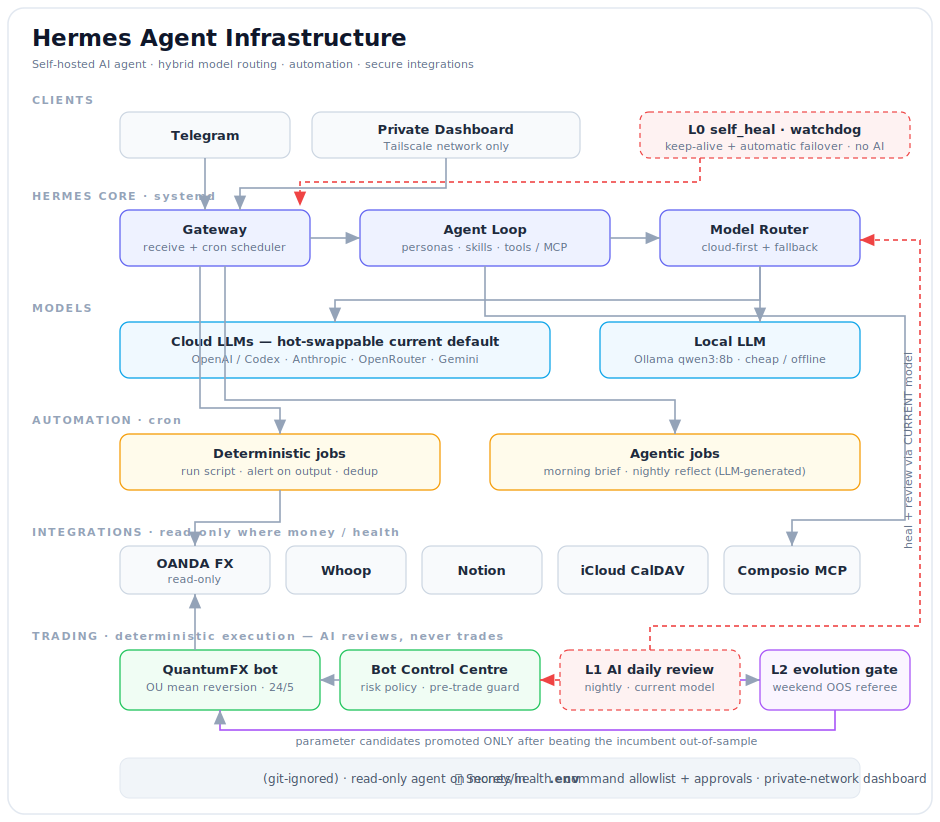
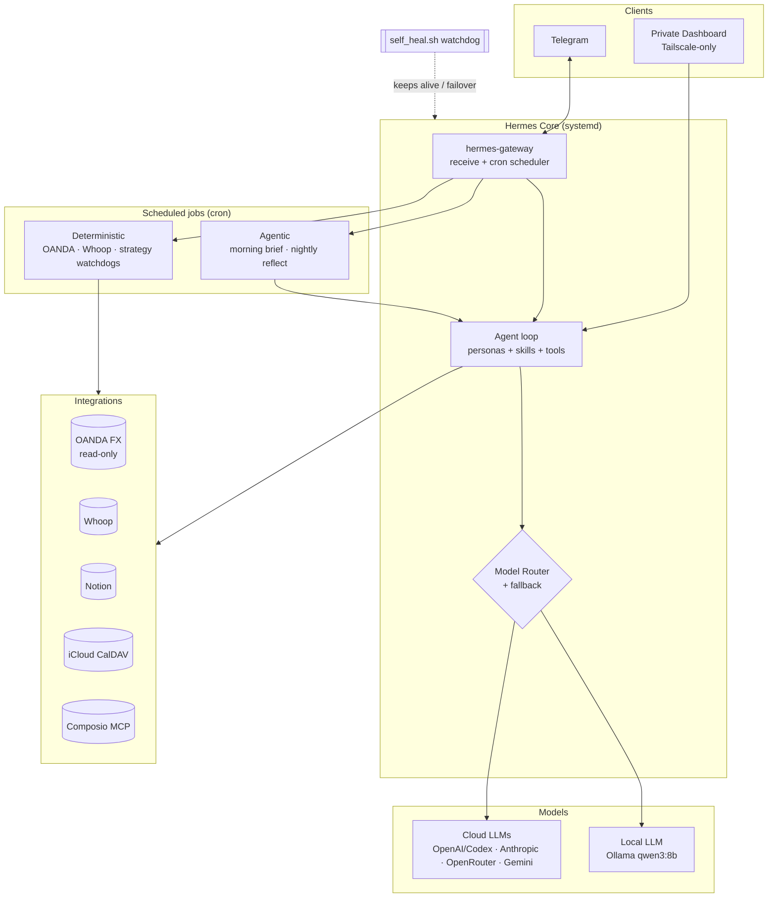

# Hermes Agent Infrastructure

> Self-hosted AI agent infrastructure using local/cloud model routing, LiteLLM,
> automation workflows, and secure API integrations — running as an always-on
> service on a Linux VPS.

[](https://github.com/navysum/hermes-agent-infrastructure/actions/workflows/ci.yml)
[]()
[]()
[]()
[](LICENSE)

**By [Craig Ataide](https://github.com/navysum)** — CS student focused on cybersecurity ·
[GitHub](https://github.com/navysum) · [LinkedIn](https://www.linkedin.com/in/craigataide)



---

## Table of contents

- [Overview](#overview)
- [What it does](#what-it-does)
- [Technologies used](#technologies-used)
- [Key features](#key-features)
- [System architecture overview](#system-architecture-overview)
- [Security considerations](#security-considerations)
- [Setup instructions](#setup-instructions)
- [What I learned](#what-i-learned)
- [Recruiter-friendly summary](#recruiter-friendly-summary)
- [Repository layout](#repository-layout)
- [Contact](#contact)

---

## Overview

**Hermes Agent** is a self-hosted AI agent infrastructure project designed to
experiment with AI assistants, local and cloud model routing, automation
workflows, LiteLLM, OpenClaw/OpenCode-style agents, and secure API integrations.
The project demonstrates practical experience with Linux servers, AI agent
orchestration, model routing, authentication, deployment, and operational
resilience.

It runs continuously on an Ubuntu VPS as a set of systemd services, routes
requests across **cloud and locally-hosted LLMs**, exposes a **Telegram control
surface** with instant slash-commands, schedules **deterministic and agentic
cron jobs**, and integrates with real third-party APIs (calendar, health,
notes, market data, messaging) — all behind a credential layer that keeps
secrets out of the codebase.

> This repository is a **sanitized portfolio extract** of a live deployment.
> Every API key, token, chat ID, database ID, server IP and personal identifier
> has been replaced with a placeholder. Runtime state (databases, logs,
> memories, auth tokens) is intentionally excluded — see
> [Security considerations](#security-considerations).

---

## What it does

- **Routes model traffic** across multiple providers with automatic fallback —
  cloud models (OpenAI / Codex `gpt-5.x`, Anthropic Claude, OpenRouter,
  Google Gemini) and a **local Ollama model** (`qwen3:8b`) for cheap/offline
  inference — configured declaratively in [`config/config.example.yaml`](config/config.example.yaml).
- **Orchestrates an always-on agent** (`hermes-gateway` + `hermes-dashboard`
  systemd services) that receives messages, runs tools, and replies.
- **Schedules work** through a native cron scheduler: deterministic jobs
  (market/health/system alerts) and **agentic jobs** (a daily LLM-generated
  morning brief, a nightly reflection) — with per-job de-duplication and an
  output archive.
- **Exposes a Telegram surface**: ~16 instant slash-commands (`/money`,
  `/trades`, `/health`, `/sys`, `/bots`, `/brief`, …) plus conversational mode,
  with the command menu re-asserted on a schedule.
- **Integrates real APIs** read-only where money/health is involved:
  OANDA (FX account NAV/P&L), Whoop (recovery/sleep → Notion), Notion
  (tasks/health/projects), iCloud CalDAV (calendar), Composio (MCP tool router),
  Slack/Discord.
- **Self-heals**: a watchdog ([`ops/self_heal.sh`](ops/self_heal.sh)) keeps the
  core services alive, and revives a **failsafe backup agent** if the primary
  gateway goes down, then re-parks it once health is restored.
- **Routes personas**: a lightweight classifier ([`scripts/persona_router.py`](scripts/persona_router.py))
  picks a response persona based on message intent.
- **Runs a quantitative FX trading bot** ([`quantumfx/`](quantumfx/)): a
  walk-forward validated Ornstein-Uhlenbeck mean-reversion strategy — winner
  of a 10-strategy backtest tournament on real spread data — deployed 24/5
  with server-side stops, margin guards, deploy gates and Telegram controls.

---

## Technologies used

| Area | Tools |
|---|---|
| **Languages** | Python 3.10+, Bash |
| **AI / LLM** | LiteLLM-style provider routing, Ollama (local), OpenAI/Codex, Anthropic, OpenRouter, Google Gemini |
| **Agent framework** | Hermes agent (CLI + dashboard + gateway), skills & personas, MCP tool routing (Composio) |
| **Messaging** | Telegram Bot API, Slack, Discord |
| **Integrations** | OANDA v20 REST, Whoop OAuth2, Notion API, iCloud CalDAV |
| **Infra / ops** | Ubuntu VPS, systemd, cron, Tailscale (private networking), reverse proxy |
| **Practices** | 12-factor secrets (`.env`), least-privilege API scopes, idempotent jobs, watchdog/failover |

---

## Key features

- 🧠 **Hybrid model routing** — declarative provider list with cloud-first,
  local-fallback strategy; keeps cost and latency low while staying resilient
  to provider outages.
- 🛰️ **Always-on, observable** — systemd services + a private dashboard
  (reachable only over Tailscale, not the public internet).
- ⏰ **Deterministic *and* agentic scheduling** — cron jobs that range from
  "run this shell script and alert on output" to "have the agent write today's
  brief and deliver it."
- 💬 **Instant Telegram control plane** — sub-second `type: exec` commands that
  bypass the LLM for status checks, alongside full conversational mode.
- 🔌 **Composable skills** — self-contained `SKILL.md` capability packs the
  agent discovers and loads on demand (see [`skills/`](skills/)).
- 🛡️ **Safety rails** — command allowlist, tool approvals, read-only financial
  integrations (the agent **observes and alerts; it never executes trades or
  moves money**), and secret redaction in logs.
- ♻️ **Operational resilience** — self-healing watchdog with automatic failover
  to a backup agent and auto-recovery.

---

## System architecture overview



See [`docs/ARCHITECTURE.md`](docs/ARCHITECTURE.md) for the component-by-component
breakdown and the repository layout.

---

## Security considerations

Security was a first-class design constraint, not an afterthought:

- **No secrets in the repo.** All credentials load from a `.env` file that is
  git-ignored. This repo ships only [`.env.example`](.env.example) with ~50
  placeholder keys. The committed config is `config.example.yaml` with every
  sensitive value redacted.
- **Runtime state is excluded.** Databases (`*.db`), logs, agent `memories/`,
  `auth.json`, cron state, and message history are git-ignored — they contain
  personal data and tokens.
- **Read-only money & health.** Financial integrations (OANDA) and health
  integrations (Whoop) are used in **read-only** mode. The agent surfaces
  analysis and alerts; **it never places orders or transfers funds** — live
  trading never routes through an agent.
- **Least-privilege surface.** The dashboard rejects non-local `Host` headers
  and is only reachable over a private Tailscale network via a localhost-bound
  reverse proxy ([`ops/hermes-dashboard-tailnet-proxy.py`](ops/hermes-dashboard-tailnet-proxy.py)) —
  never exposed to the public internet.
- **Guard rails on tools.** A command allowlist plus an approvals layer gate
  what the agent may execute; secret redaction is enabled on tool output/logs.
- **Single-use token hygiene.** OAuth refresh flows (e.g. Whoop) are serialized
  to avoid burning single-use refresh-token chains.

> If you fork this: copy `.env.example` → `.env`, fill in your own credentials,
> and keep `.env` out of version control (it already is, via `.gitignore`).

---

## Setup instructions

> These steps reproduce the orchestration layer. The `hermes` agent runtime
> itself is installed separately.

```bash
# 1. Clone
git clone https://github.com/<your-account>/hermes-agent-infrastructure.git
cd hermes-agent-infrastructure

# 2. Configure secrets
cp .env.example .env
$EDITOR .env                      # fill in your real keys/tokens

# 3. Configure model routing & agent behaviour
cp config/config.example.yaml config/config.yaml
$EDITOR config/config.yaml        # set providers, personas, cron, telegram, etc.

# 4. (Optional) local model
#    Install Ollama and pull a small local fallback model
ollama pull qwen3:8b

# 5. Wire up scheduling
#    The scripts in scripts/ are intended to be driven by the agent's cron
#    scheduler (or a plain crontab). Each is standalone and idempotent.
chmod +x scripts/*.sh ops/*.sh

# 6. Operational watchdog (optional, requires systemd services)
#    ops/self_heal.sh is designed to run on a short interval to keep the core
#    services alive and fail over to a backup agent if needed.
```

### Environment variables

All configuration is driven by environment variables. The full list of keys
lives in [`.env.example`](.env.example). Highlights:

```bash
ANTHROPIC_API_KEY=your_anthropic_api_key_here
OPENAI_API_KEY=your_openai_api_key_here
OPENROUTER_API_KEY=your_openrouter_api_key_here
GEMINI_API_KEY=your_gemini_api_key_here
TELEGRAM_BOT_TOKEN=your_telegram_bot_token_here
TELEGRAM_HOME_CHANNEL=your_id_here
NOTION_API_KEY=your_notion_api_key_here
COMPOSIO_API_KEY=your_composio_api_key_here
# ...see .env.example for the complete set (~50 keys)
```

---

## What I learned

- **Designing for resilience over a flaky dependency surface.** LLM providers
  rate-limit, time out, and change. A declarative router with ordered fallbacks
  (and a local model as the floor) turned "the bot is down" into a non-event.
- **Cloud vs. local trade-offs.** Running a local model under memory pressure on
  a small VPS taught me to make the default model cloud-hosted and reserve the
  local model for cheap/offline paths — and to size processes against real RAM.
- **Idempotency and de-duplication matter** the moment you put an agent on a
  cron. I added per-job state + dedup so a re-run or overlap never double-posts.
- **Secrets discipline is a workflow, not a rule.** 12-factor `.env`, redaction
  in logs, and keeping all runtime state out of git made it safe to open-source
  the orchestration without leaking a single credential.
- **Keep humans in the loop where it counts.** The agent is read-only on money
  and health; anything that could move real funds requires a human. Boundaries
  like this are what make autonomous automation trustworthy.
- **Operational glue is the real work.** systemd units, a watchdog with
  failover, a Tailscale-only dashboard, and a scheduled Telegram menu sync were
  what turned a prototype into something that runs unattended for weeks.

---

## Recruiter-friendly summary

This project demonstrates **end-to-end ownership of a production-style AI
system on Linux**: provisioning and operating always-on services, orchestrating
multiple LLM providers with cost/latency/resilience trade-offs, building a
messaging control plane, scheduling deterministic and agentic automation,
integrating half a dozen third-party APIs securely, and engineering for
failure with watchdogs and failover. It reflects hands-on skills in
**Python, Bash, Linux/systemd, API integration, AI agent orchestration, model
routing, authentication, deployment, and operational security** — with a
consistent emphasis on keeping secrets safe and humans in control of anything
consequential.

---

## Repository layout

```
.
├── config/
│   └── config.example.yaml      # model routing, personas, cron, telegram (redacted)
├── scripts/                     # ~30 orchestration & integration jobs (sanitized)
│   ├── persona_router.py        #   intent → persona classifier
│   ├── oanda_signal_alerts.py   #   read-only FX account alerts
│   ├── whoop_*.py / *.sh        #   health sync (OAuth2 → Notion)
│   ├── brief_*.{py,sh}          #   morning-brief data assembly
│   ├── job_*.sh                 #   cron entrypoints (dedup-wrapped)
│   └── qc_*.sh                  #   instant Telegram quick-commands
├── skills/                      # self-contained agent capability packs
│   ├── service-health-check/    #   generic, read-only service health skill
│   └── infrastructure-audit/    #   audit framework with severity ratings
├── ops/
│   ├── self_heal.sh             # watchdog + failover
│   └── hermes-dashboard-tailnet-proxy.py
├── quantumfx/                   # walk-forward validated FX trading bot (see its README)
│   ├── quantumfx/               #   live bot package (strategy/risk/execution)
│   ├── research/                #   backtest harness, 10 strategies, agent validation reports
│   └── tests/                   #   deploy-gate test suite
├── docs/
│   └── ARCHITECTURE.md
├── .env.example                 # ~50 placeholder credential keys
└── .gitignore
```

---

## Contact

**Craig Ataide** — Computer Science student focused on cybersecurity and
practical AI/automation engineering.

- GitHub: [@navysum](https://github.com/navysum)
- LinkedIn: [craigataide](https://www.linkedin.com/in/craigataide)

Open to software engineering, security, and AI/infra opportunities — feel free
to reach out.

---

## License

Released under the [MIT License](LICENSE) © 2026 Craig Ataide.
